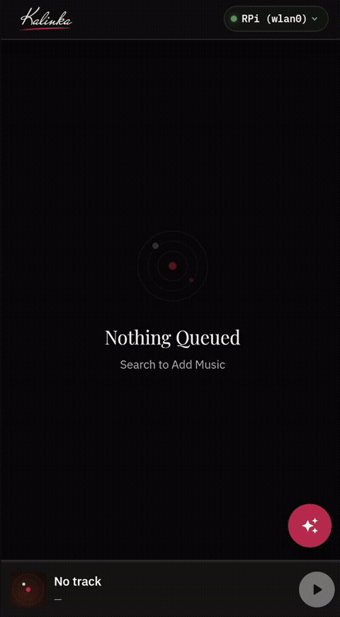

# Kalinka
Kalinka Player client with AI search and recommendations

Website: [kalinkaplayer.com](https://kalinkaplayer.com)

Ask for a mood, get a queue. Semantic search turns a phrase like
_"something melancholic for tonight"_ into matching tracks:

## Getting started
- **[Initial setup guide](docs/initial-setup.md)** — server installation,
  pointing it at your music collection, and connecting the app.
- **[App manual](docs/app-manual.md)** — illustrated tour: the setup
  wizard, the server chip and settings, music folders, AI search and
  queueing.

Releases (Android APKs and a Linux desktop build) are on the
[releases page](https://github.com/madenvel/KalinkaAI/releases).

## License
- Source code: Apache License 2.0 (see LICENSE and NOTICE).
- Visual assets (icons, logos, images): Private license (see LICENSE-ASSETS).

Visual assets are not open-source in this repository and require prior author
permission for use.

Permission contact:
Dmitry Savin <envelsavinds@gmail.com>

## Distribution
- Open-source/community builds: You can distribute the code under Apache 2.0, but replace visual assets with your own assets unless you have explicit author permission.
- Official asset redistribution: Requires prior written permission from the author.
