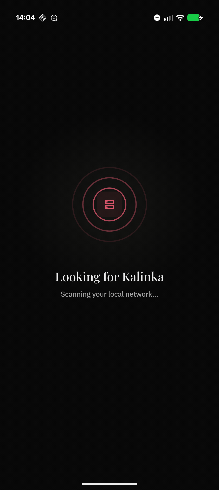
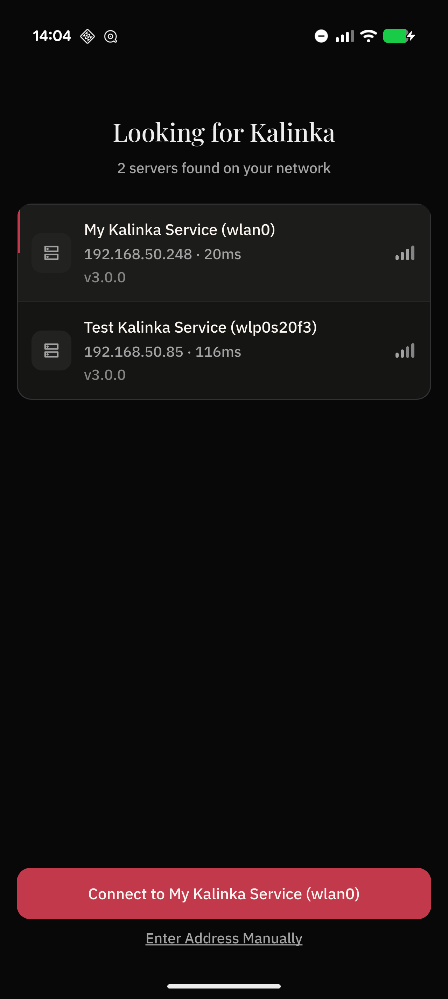
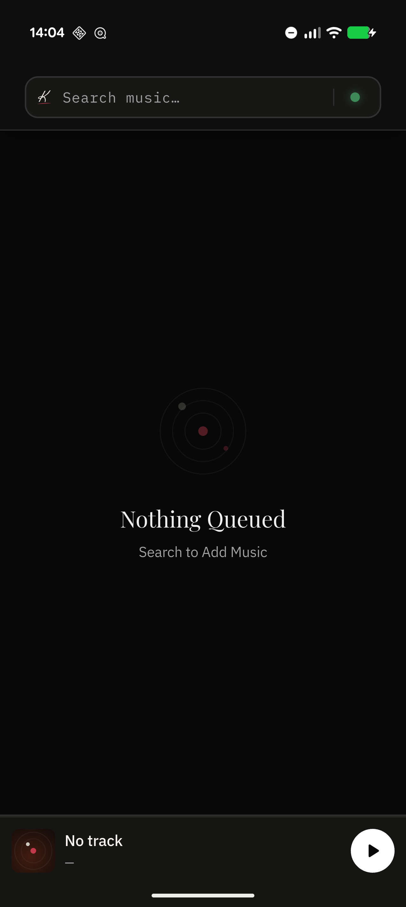
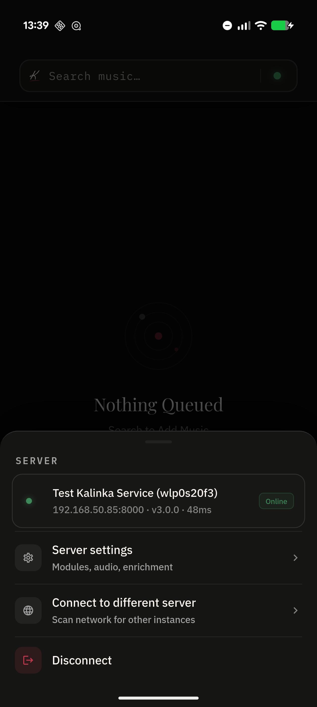
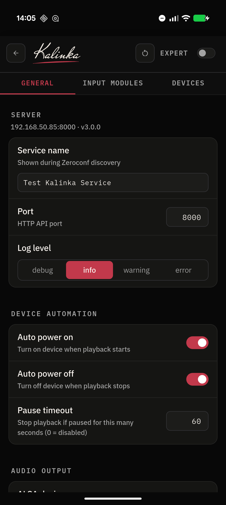
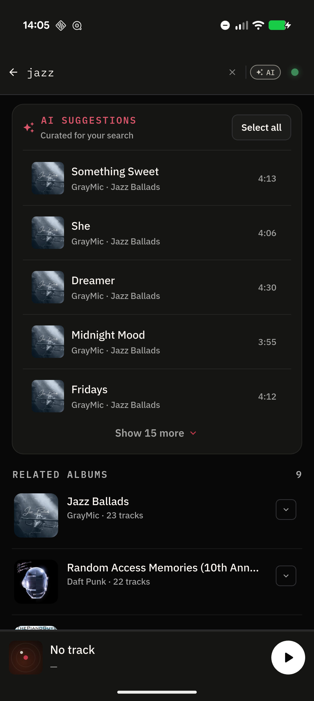
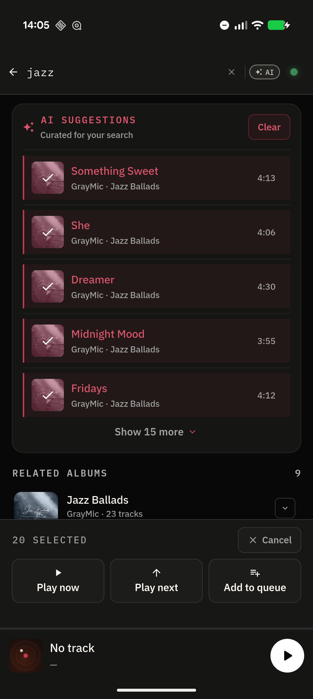
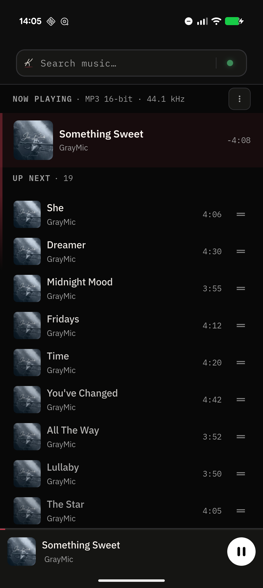
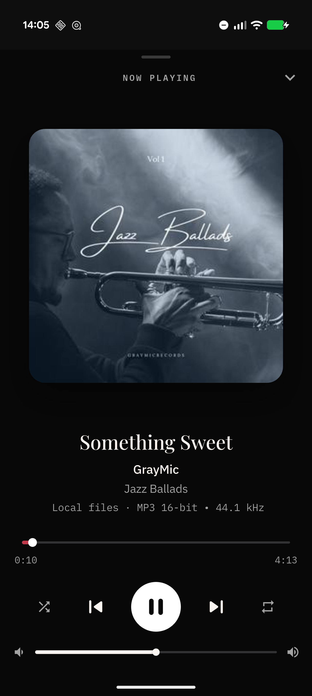

# Kalinka app manual

How to get from first launch to playing music. Server installation is
covered separately in the [initial setup guide](initial-setup.md).

## 1. First launch — find and connect to your server

The app starts by scanning your network for Kalinka servers. After a few
seconds every server it finds appears in a list — pick yours and tap the
**Connect** button at the bottom.

| Scanning | Servers found |
|:---:|:---:|
|  |  |

If nothing shows up, the phone and the server are probably not on the same
network (or the router blocks multicast/mDNS) — use **Enter Address
Manually** at the bottom and type `<server-ip>:8000`.

## 2. The main screen

After connecting you land on the play queue. On a fresh server it greets
you with *"Nothing Queued"*:

The three things to know:

- **Search bar** (top) — tap to search your library and add music.
- **Mini player** (bottom) — the current track; tap it to open the full
  player.
- **The green dot** (top-right, inside the search bar) — your server's
  status light **and a button**. This is the door to everything
  server-related; it's easy to miss, so:

## 3. The green dot — server menu and settings

Tap the **green dot** to open the server sheet:

From here you can see the connection status, server address, version and
latency, and reach:

- **Server settings** — all configuration (see next section)
- **Connect to different server** — rescan the network and switch
- **Disconnect**

The dot also tells you the connection state at a glance: green — online,
amber — connecting/reconnecting, grey — offline.

## 4. Add your music folders

The one thing every new install needs. From the server sheet tap
**Server settings**:

1. Switch to the **Input Modules** tab.
2. Open **Local files**.
3. Add your collection path(s) under **Music folders** — e.g.
   `/srv/kalinka/music` (see the [initial setup
   guide](initial-setup.md#2-put-your-music-where-the-server-can-see-it)
   for where the folder should live and the permissions it needs).

The indexer picks the folder up automatically (every 15 minutes, plus a
file watcher for instant changes). While you're in settings, the
**General** tab has the other first-run essentials: the service name shown
in discovery, the ALSA **audio output** device, and **device automation**
(auto power on/off). The **EXPERT** toggle at the top reveals the advanced
tier.

## 5. Search and queue music

Tap the search bar and type. Results are grouped (tracks, albums,
artists), with filters for scope and genre. The **AI** toggle next to the
search field switches to natural-language search — describe what you want
("jazz", "melancholic evening piano") and the server curates suggestions
from your library:

| AI suggestions | Batch selection |
|:---:|:---:|
|  |  |

Tap **Select all** (or long-press individual tracks) to enter selection
mode, then choose **Play now**, **Play next**, or **Add to queue**.

## 6. The queue and the player

Back on the main screen your queue is live: the current track on top,
**UP NEXT** below, drag handles to reorder, swipe to remove. Tap the mini
player to expand the full player with artwork, format/quality info,
transport controls and volume:

| Play queue | Player |
|:---:|:---:|
|  |  |

## Troubleshooting

See the [initial setup guide](initial-setup.md#troubleshooting) — empty
library, no server found, and no-sound issues are covered there.
